# Arquitectura del Sistema de Microservicios

Este documento describe en detalle la arquitectura del sistema de microservicios desarrollado con Laravel Lumen.

## 📐 Diagrama de Arquitectura General

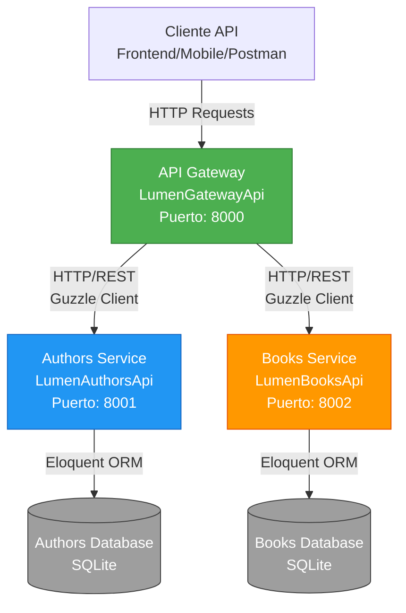

## 🔄 Flujo de Peticiones

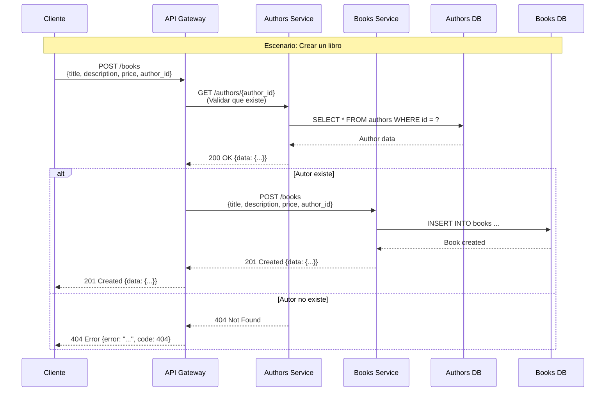

## 🏗️ Diagrama de Componentes

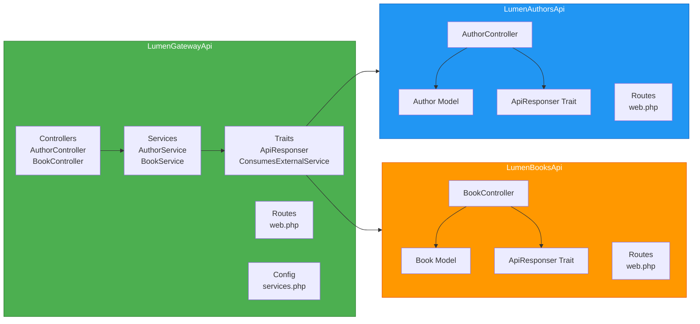

## 📊 Modelo de Datos

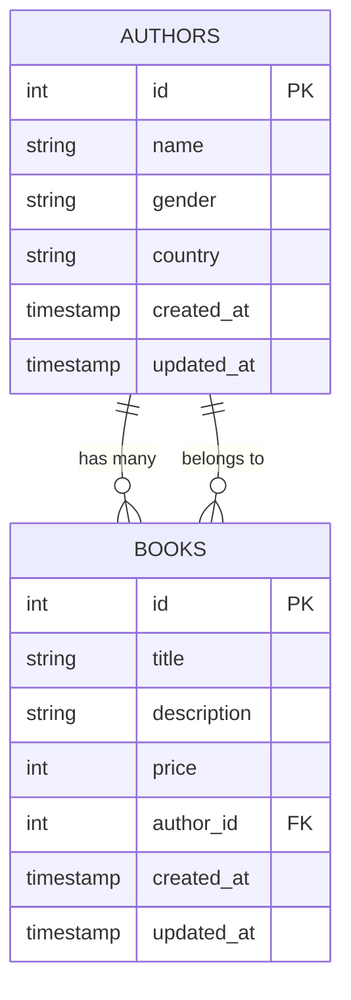

## 🔀 Flujo de Operaciones CRUD

### Operación GET (Leer)

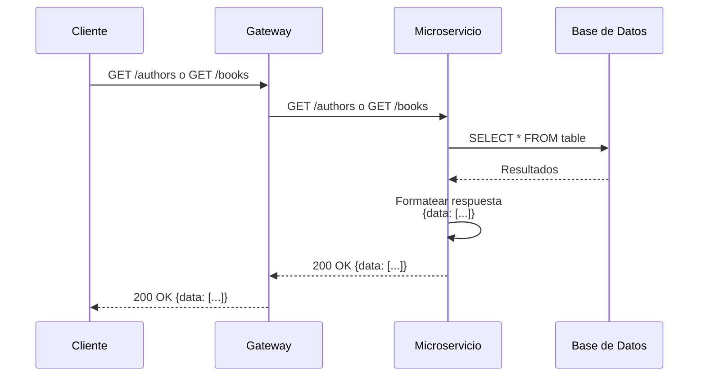

### Operación POST (Crear)

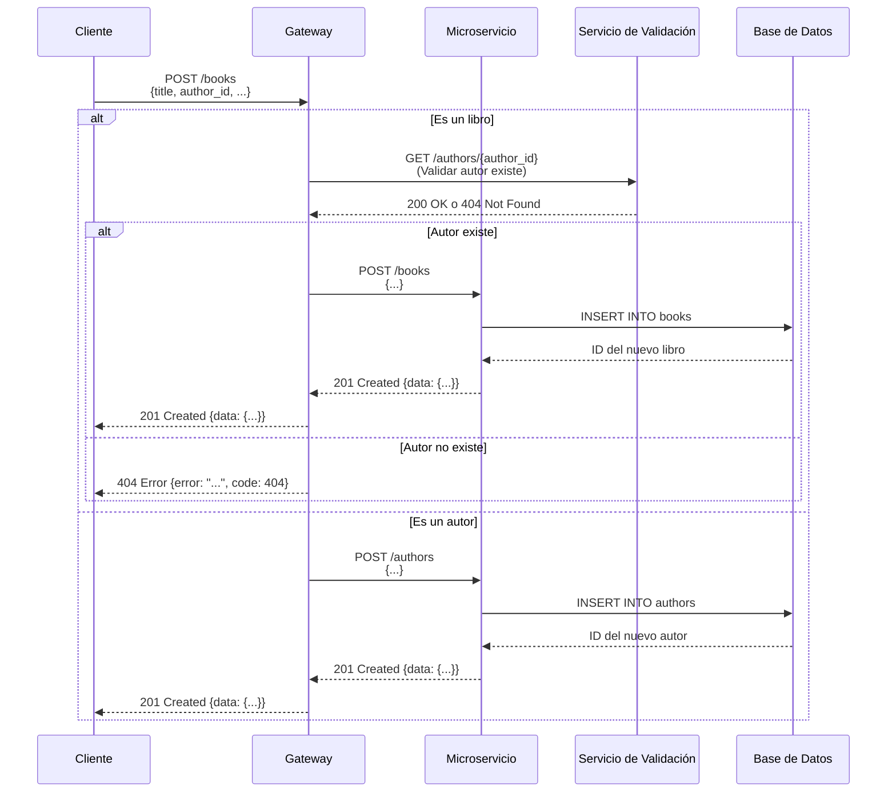

### Operación PUT/PATCH (Actualizar)

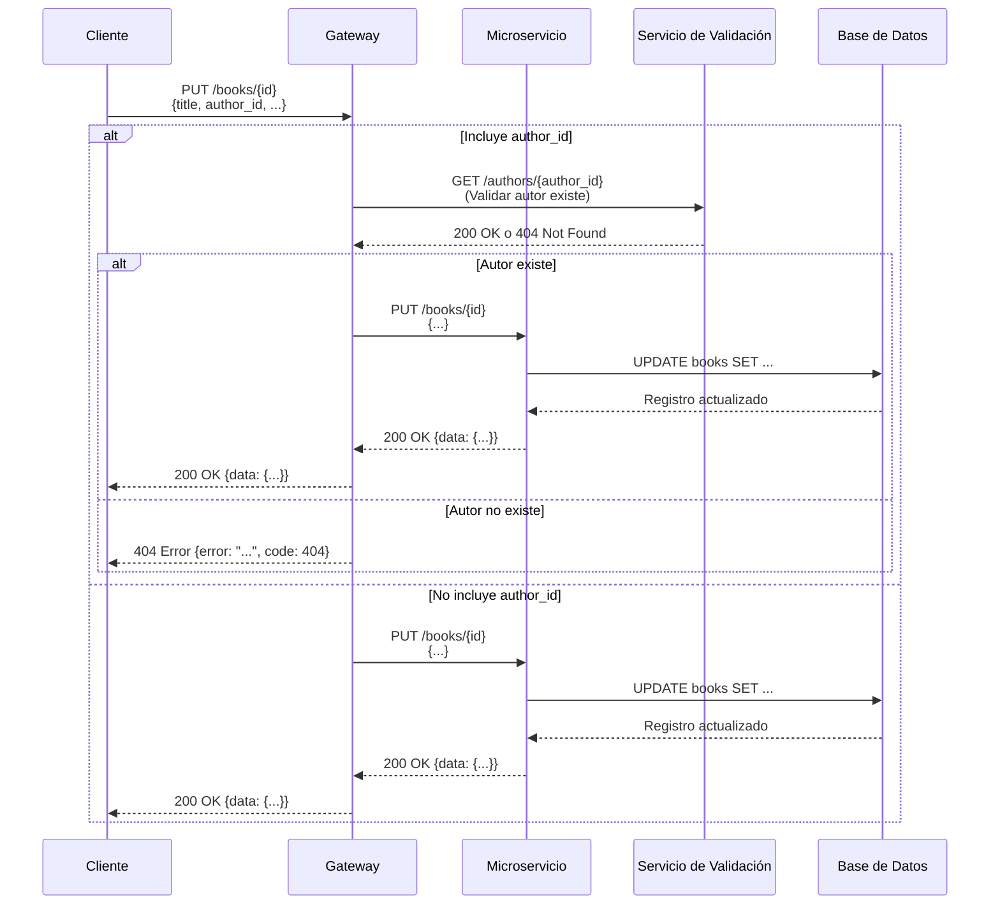

### Operación DELETE (Eliminar)

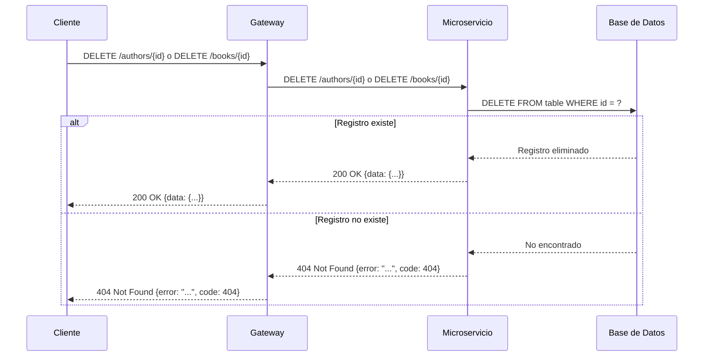

## 🌐 Arquitectura de Red

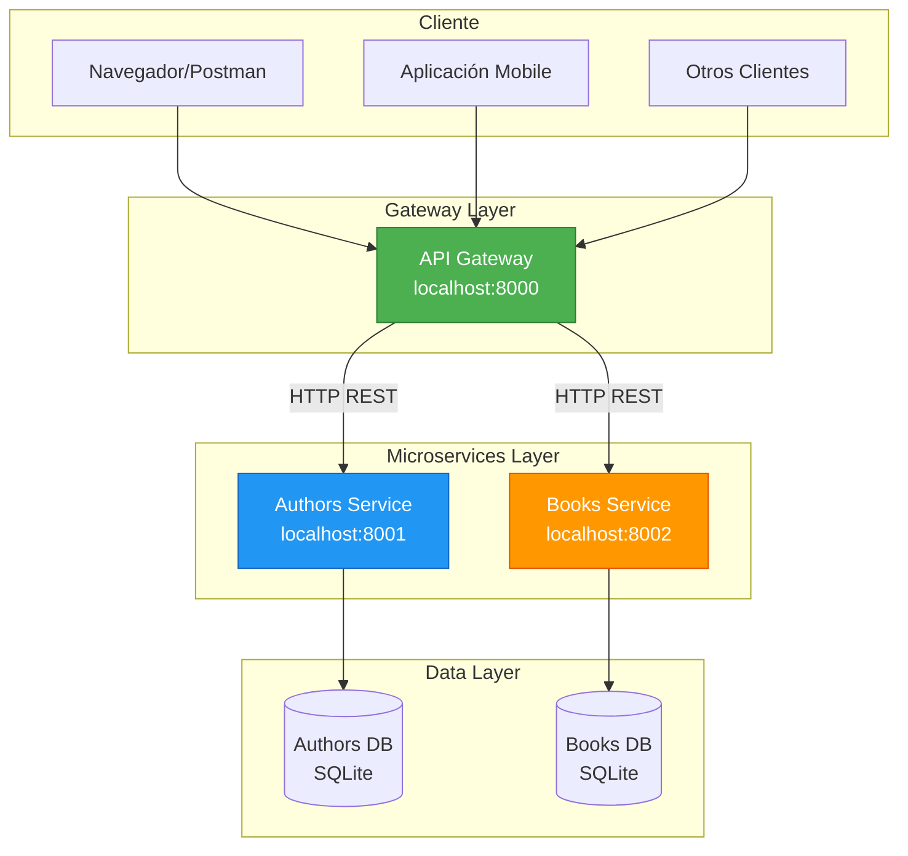

## 🔧 Patrones Arquitectónicos Implementados

### 1. API Gateway Pattern

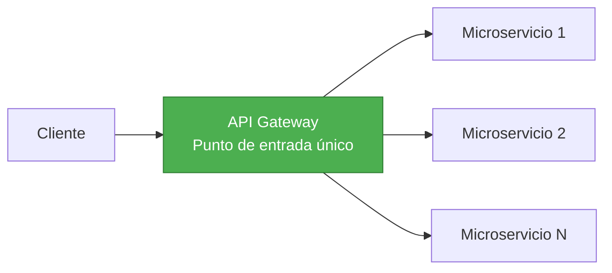

**Beneficios:**
- Punto de entrada único para todos los clientes
- Enrutamiento centralizado
- Validación de reglas de negocio entre servicios
- Transformación de respuestas

### 2. Database per Service Pattern

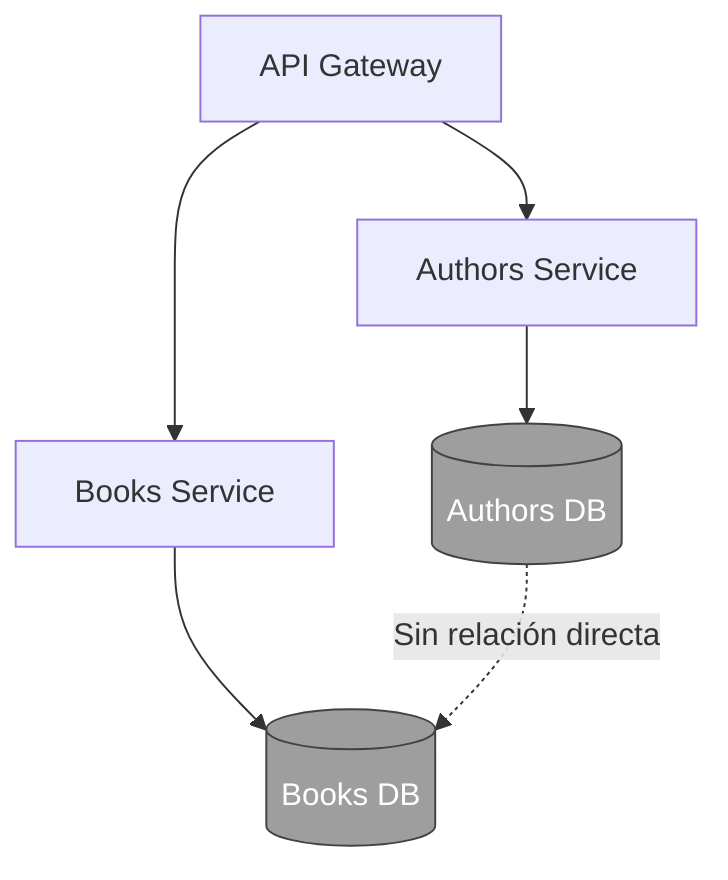

**Características:**
- Cada microservicio tiene su propia base de datos
- No hay acoplamiento a nivel de datos
- Independencia de despliegue y escalado

### 3. Service Communication Pattern

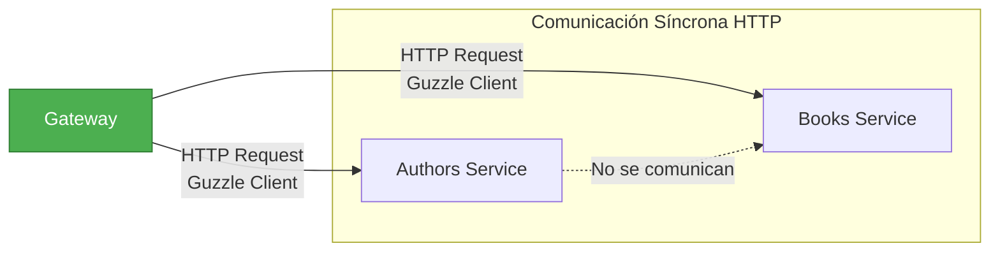

**Características:**
- Comunicación síncrona mediante HTTP REST
- El Gateway orquesta las llamadas
- Los microservicios no se comunican directamente entre sí

## 📁 Estructura Completa del Proyecto

```mermaid
graph TB
    subgraph Root[arquitecturaMicroServicios/]
        subgraph Services[Microservicios]
            Authors[LumenAuthorsApi/]
            Books[LumenBooksApi/]
            Gateway[LumenGatewayApi/]
        end
        
        subgraph Docs[Documentación]
            APIDocs[docs/<br/>OpenAPI/Swagger]
            ArchDoc[arquitectura.md]
            Guide[guiaEstudiante.md]
        end
        
        subgraph CI[CI/CD]
            GitHub[.github/workflows/]
            GitLab[.gitlab-ci.yml]
            Pipeline[pipeline/]
        end
        
        subgraph Scripts[Scripts de Prueba]
            TestAPI[test_api.sh]
            TestGateway[test_gateway_simple.sh]
        end
        
        Root --> Services
        Root --> Docs
        Root --> CI
        Root --> Scripts
    end
    
    style Authors fill:#2196F3,stroke:#1565C0,color:#fff
    style Books fill:#FF9800,stroke:#E65100,color:#fff
    style Gateway fill:#4CAF50,stroke:#2E7D32,color:#fff
    style APIDocs fill:#9C27B0,stroke:#6A1B9A,color:#fff
    style CI fill:#F44336,stroke:#C62828,color:#fff
```

## 📦 Estructura de Componentes Detallada

```mermaid
graph TB
    subgraph GatewayComponents[Componentes del Gateway]
        Routes[Routes<br/>web.php]
        Controllers[Controllers<br/>AuthorController<br/>BookController]
        Services[Services<br/>AuthorService<br/>BookService]
        Traits[Traits<br/>ApiResponser<br/>ConsumesExternalService]
        Config[Config<br/>services.php<br/>.env]
    end
    
    subgraph AuthorsComponents[Componentes de Authors Service]
        ARoutes[Routes<br/>web.php]
        AController[AuthorController]
        AModel[Author Model<br/>Eloquent]
        ATrait[ApiResponser Trait]
        AMigrations[Migrations<br/>create_authors_table]
    end
    
    subgraph BooksComponents[Componentes de Books Service]
        BRoutes[Routes<br/>web.php]
        BController[BookController]
        BModel[Book Model<br/>Eloquent]
        BTrait[ApiResponser Trait]
        BMigrations[Migrations<br/>create_books_table]
    end
    
    Routes --> Controllers
    Controllers --> Services
    Services --> Traits
    Services --> Config
    
    ARoutes --> AController
    AController --> AModel
    AController --> ATrait
    AModel --> AMigrations
    
    BRoutes --> BController
    BController --> BModel
    BController --> BTrait
    BModel --> BMigrations
    
    style GatewayComponents fill:#4CAF50,stroke:#2E7D32,color:#fff
    style AuthorsComponents fill:#2196F3,stroke:#1565C0,color:#fff
    style BooksComponents fill:#FF9800,stroke:#E65100,color:#fff
```

## 🔐 Flujo de Validación y Manejo de Errores

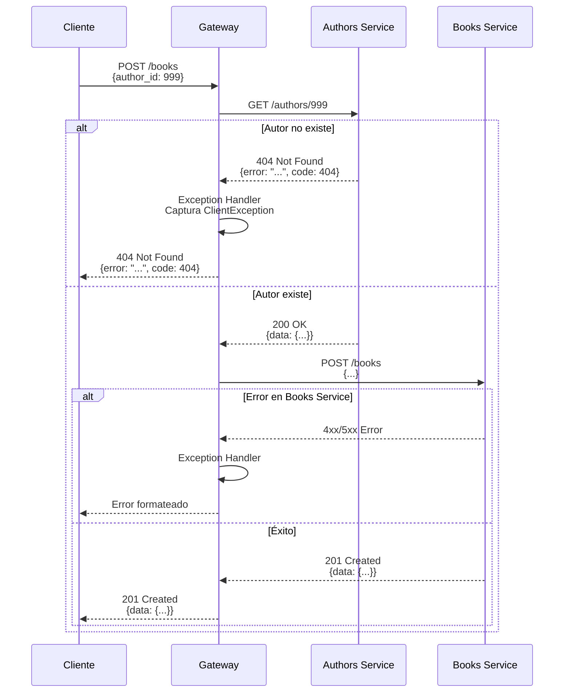

## 🚀 Despliegue y Escalabilidad

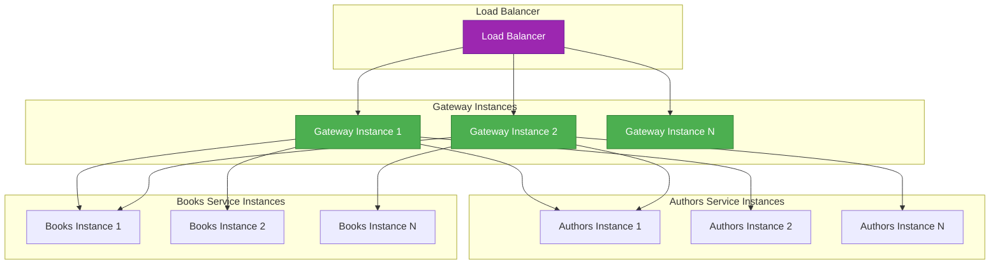

## 🔄 Pipeline CI/CD

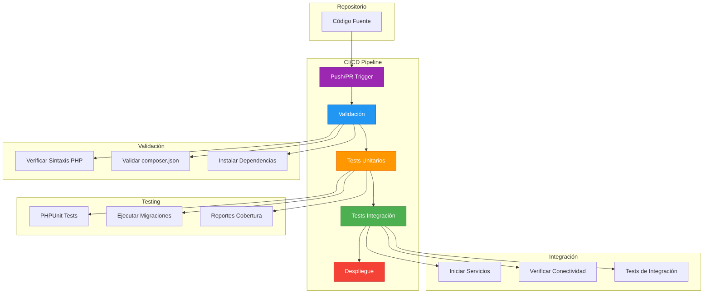

**Plataformas Soportadas:**
- **GitHub Actions**: `.github/workflows/ci.yml`
- **GitLab CI**: `.gitlab-ci.yml`

**Etapas del Pipeline:**
1. **Validación**: Verificación de sintaxis PHP y validación de dependencias
2. **Tests Unitarios**: Ejecución de PHPUnit en cada microservicio
3. **Tests de Integración**: Verificación de comunicación entre servicios
4. **Despliegue**: Despliegue manual a staging/production (GitLab)

## 📝 Resumen de Tecnologías

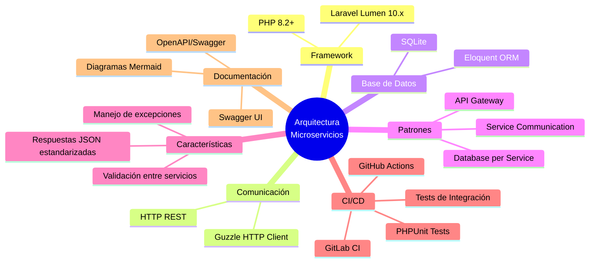

## 🎯 Principios de Diseño Aplicados

1. **Separación de Responsabilidades**: Cada microservicio gestiona un dominio específico
2. **Independencia**: Cada servicio puede desplegarse y escalarse independientemente
3. **Comunicación Débilmente Acoplada**: Los servicios se comunican mediante HTTP REST
4. **Base de Datos Independiente**: Cada servicio tiene su propia base de datos
5. **Punto de Entrada Único**: El Gateway centraliza todas las peticiones
6. **Validación Centralizada**: El Gateway valida reglas de negocio entre servicios
7. **Integración Continua**: Pipeline CI/CD automatizado para validación y testing
8. **Documentación Primero**: APIs documentadas con OpenAPI/Swagger

## 📚 Documentación y Herramientas

### Documentación de APIs
- **OpenAPI 3.0**: Especificaciones completas para cada servicio
- **Swagger UI**: Interfaz interactiva para probar endpoints
- **Visualización**: Disponible en `docs/index.html`

### CI/CD Pipeline
- **Validación Automática**: Verificación de código en cada push
- **Tests Automatizados**: Ejecución de PHPUnit y tests de integración
- **Reportes**: Cobertura de código y resultados de tests

### Herramientas de Desarrollo
- **Scripts de Prueba**: `test_api.sh`, `test_gateway_simple.sh`
- **Validación Local**: `pipeline/local-test.sh`
- **Documentación**: Scripts para servir documentación localmente

---

**Nota**: Los diagramas Mermaid pueden visualizarse en editores como VS Code con la extensión "Markdown Preview Mermaid Support" o en plataformas como GitHub, GitLab, o [Mermaid Live Editor](https://mermaid.live/).
